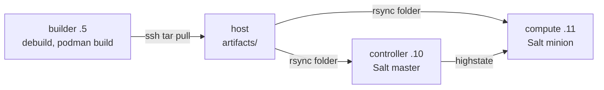
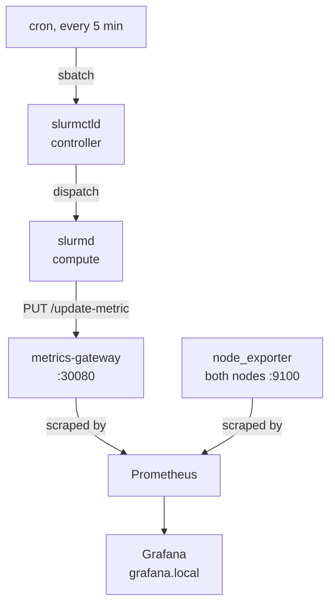

# HPC-DevOps hybrid orchestrator

A three-node Vagrant lab that puts a traditional HPC scheduler and a cloud-native
monitoring stack on the same private network and wires them together. Slurm is compiled
from source into Debian packages, installed by SaltStack, and its jobs report live load
into Prometheus through a small custom gateway that ends up on a Grafana dashboard. One
`vagrant up` builds all of it from nothing.

| Node | IP | Role |
|---|---|---|
| builder | .5 | Ephemeral. Compiles the Slurm DEBs and container images, exports them, powers off. |
| controller | .10 | Salt master and its own minion. slurmctld, slurmdbd, MariaDB, munge, node_exporter under Podman. |
| compute | .11 | Salt minion, slurmd, and single-node K3s running kube-prometheus-stack and the gateway. |

Phase numbers below refer to the original brief, committed as
[bigarch-assignment.md](bigarch-assignment.md).

## Architecture

**Build and provisioning.** The builder compiles everything, hands it to the host, and
halts before the other two machines need it.



**The runtime loop.** Every five minutes a real Slurm job reports its own load, and the
numbers land on a Grafana panel. Nothing in this chain is mocked.



## Repository map

| Path | What it is |
|---|---|
| [Vagrantfile](Vagrantfile) | VM definitions, synced folders, triggers, provisioners |
| [salt/states/](salt/states/) | all configuration state, mapped by [top.sls](salt/states/top.sls) |
| [salt/pillar/](salt/pillar/) | every tunable value, starting at [common.sls](salt/pillar/common.sls) |
| [gateway/](gateway/) | [app.py](gateway/app.py), [test_app.py](gateway/test_app.py), [Containerfile](gateway/Containerfile) |
| [charts/metrics-gateway/](charts/metrics-gateway/) | Helm chart for the gateway |
| [dashboards/](dashboards/) | vendored Grafana JSON: 1860 and the custom Slurm panel |
| [scripts/](scripts/) | [build.sh](scripts/build.sh), [gen-secrets.sh](scripts/gen-secrets.sh), [verify.sh](scripts/verify.sh), [pull-artifacts.sh](scripts/pull-artifacts.sh) |
| [Makefile](Makefile) | `up`, `verify`, `test`, `provision`, `destroy` |
| [docs/](docs/) | the screenshots below |

The repo also keeps its own build record, because the submission criteria ask for it.
[CLAUDE.md](CLAUDE.md), [study/](study/) and [.superpowers/sdd/plan/](.superpowers/sdd/plan/)
are the working context, design notes and per-task execution log. See [AI use](#ai-use).

## Prerequisites

- Vagrant 2.4.x and VirtualBox 7.1 or 7.2. A `vmware_desktop` block is kept in the
  Vagrantfile, but VirtualBox is what this was verified on.
- About 9GB of free RAM at peak and 25GB of disk. The builder (4GB) halts before the other
  two boot, so only controller (3GB) and compute (6GB) stay up.
- `rsync` and `openssl` on the host. Synced folders are rsync type, and the secrets trigger
  generates the munge key with openssl before the first boot.
- `curl` and GNU make for `make verify`, `python3` for `make test`.

Verified on Ubuntu amd64 with VirtualBox 7.2.6 and Vagrant 2.4.9, and earlier on macOS
arm64. The box is `bento/ubuntu-24.04`, pinned, published for both architectures, and
everything compiles in-guest, so an Intel host builds matching amd64 artifacts unchanged.

One trap on Linux hosts: if VirtualBox fails with `VERR_VMX_IN_VMX_ROOT_MODE`, the in-tree
KVM modules hold the CPU's virtualization extensions. Run
`sudo modprobe -r kvm_intel kvm` (`kvm_amd` on AMD) and retry. If something keeps
loading them back, blacklist them in `/etc/modprobe.d/`.

## Quick start

```sh
git clone <this repo> && cd bigarch-devops-assignment
vagrant up            # or: make up
```

That is the whole deployment. A `before :up` trigger runs `scripts/gen-secrets.sh` first,
writing `salt/pillar/secrets.sls` with a random slurmdbd password and a random 128-byte
munge key. That file is gitignored and the script is a no-op if it already exists, so
repeated runs never rotate a live secret and no credential is committed.

Expect roughly 25 minutes cold, plus a one-time 600MB box download. The builder is the
long pole at about 14 minutes on a 16-thread host, nearly all of it compiling Slurm.
Controller takes about 4 minutes, compute about 6. A second `vagrant up` skips the
compile through the version stamp and returns almost immediately.

If provisioning dies partway, run `vagrant up` again. Every step is guarded: the builder
resumes past what it finished, and a half-provisioned node converges on the next
highstate. `make destroy` tears the lab down.

### Reaching Grafana

Point `grafana.local` at the compute node on whatever machine you browse from:

```sh
echo "192.168.56.11 grafana.local" | sudo tee -a /etc/hosts
```

Open <https://grafana.local> and log in with **admin / admin**. The browser warns about
the certificate, which is expected. The ingress asks for TLS without naming a secret, so
Traefik answers with its self-signed default. Click through it.


Node Exporter Full (dashboard 1860) on the compute node. Live CPU, memory and disk here
means the whole scrape chain is up: node_exporter, Prometheus, datasource, dashboard.

## Verifying the deployment

```sh
make verify
```

`scripts/verify.sh` runs from the host and prints one `ok` or `FAIL` line for each of its
12 checks, exiting non-zero if any failed. It asserts that the builder is powered off and
the other two are running, that `sinfo` reports a node in idle, alloc or mix, that both
node exporters answer on port 9100, that a probe metric PUT to the gateway's NodePort
returns 204 and then appears in `/metrics`, that no Prometheus target is anything but up,
and that the Grafana ingress answers with both dashboards loaded.

This is a healthy lab on the last full run, on an Ubuntu amd64 host: 17 Slurm 26.05.3 DEBs
built on the builder, K3s v1.36.4+k3s1 with the node Ready, kube-prometheus-stack 88.6.2
with every pod Running, and Prometheus reporting 15 targets with none down. That includes
the `node-exporter` job scraping both `192.168.56.10:9100` and `192.168.56.11:9100`, and
the gateway's own ServiceMonitor target. `srun` and `sbatch` round-trips reached
COMPLETED, and the gateway PUT returned 204 with the series visible on the next scrape.

`make test` covers the gateway on the host. No VM needed. It builds a venv under `gateway/`
and runs 28 pytest cases over the PUT and scrape roundtrip, label-shape conflicts,
malformed payloads, and the TTL expiry boundary.

For manual spot checks:

```sh
vagrant ssh controller -c 'srun -N1 hostname'         # prints: compute
vagrant ssh controller -c 'sacct -X --format=JobID,JobName,State'
vagrant ssh controller -c 'sudo /opt/slurm/submit_job.sh'   # fire the loop now
```

**Live Slurm Job Load** fills in within a minute of a cron job firing. On a fresh lab,
wait for the next five-minute boundary or use the last command above.

## How it works

### The builder

Its highstate applies the same shared `podman` state the controller uses, then
`salt/states/build/init.sls` runs `scripts/build.sh`. The build follows SchedMD's own
Debian flow, not a hand-rolled `configure && make`: `mk-build-deps -i debian/control`
installs build dependencies from the tarball's own control file, and `debuild -b -uc -us`
produces the separated `slurm-smd-*` packages. The gateway image is built with
`podman build` and saved as a tar next to the node_exporter image.

Everything lands in `/opt/artifacts`. A Vagrant trigger streams that directory to the host
over `vagrant ssh builder -c 'sudo tar -cf -'` and powers the machine off, and the rsync
synced folder carries it on into the other two guests. Two stamps gate the work:
`BUILD_STAMP` for the DEBs, `IMAGE_STAMP` for the image tars including a content hash of
`gateway/`, so editing gateway source rebuilds only the image and skips the 14-minute
compile. Controller and compute preconditions key off `BUILD_STAMP`, so a missing build
fails early with a message naming the fix.

### The controller

The Vagrant salt provisioner installs the master with `auto_accept: True` and the
controller's own minion, but with `run_highstate: false`. Vagrant refuses `install_master`
together with `run_highstate` unless minion keys are pre-seeded, and its master-mode
highstate path does not propagate state failures anyway. A follow-up shell provisioner runs
`salt-call state.highstate --retcode-passthrough` instead, which keeps the mandated
provisioner and makes a failed state actually fail `vagrant up`.

The states then run in dependency order: munge key from pillar, MariaDB with the accounting
database, the DEBs installed by pointing `apt-get install` at their paths rather than
`dpkg -i` so apt resolves the dependencies between them, then slurmdbd and slurmctld. Last
is node_exporter as a Podman Quadlet unit, so systemd owns its lifecycle and a re-run
cannot produce a second container.

### The compute node

The minion registers with the master at `192.168.56.10` and its key is accepted
automatically. Slurm's compute-side packages, `slurm.conf` and `cgroup.conf` all come from
the same shared state the controller uses.

K3s needs three flags:
`--node-ip 192.168.56.11 --flannel-iface <private nic> --write-kubeconfig-mode 644`.
Without the first two it binds Vagrant's NAT interface and nothing on the private network
reaches the API server or the gateway's NodePort. The interface name is derived from
whichever NIC holds the compute address, not hardcoded to `eth1`, with a pillar override.

Both Helm releases go in through `helm upgrade --install --wait`: kube-prometheus-stack
from the upstream repo at a pinned chart version, and the local gateway chart from
`/vagrant/charts/metrics-gateway`. The gateway chart ships a ServiceMonitor carrying
kube-prometheus-stack's release label, without which Prometheus never selects it and the
validation loop produces an empty panel. Both dashboards arrive as labelled ConfigMaps
that Grafana's sidecar imports.

### The Phase 5 loop

`cron.present` on the controller writes one root crontab entry running
`/opt/slurm/submit_job.sh` every five minutes. That wrapper does nothing but
`sbatch /opt/slurm/simulate_metrics.sbatch` with absolute paths, because cron's PATH is
close to empty.

The job loops twelve times with a five-second sleep. Each pass PUTs three metrics
(`slurm_job_cpu_percent`, `slurm_job_gpu_percent`, `slurm_job_mem_mb`) to the gateway on
`192.168.56.11:30080`, labelled with `slurm_job_id` and `node` taken from `SLURM_JOB_ID`
and `SLURMD_NODENAME`. Those variables only exist inside a Slurm-launched process, which is
why this is a real Slurm job and not a shell script pretending to be one. The gateway keeps
its series in memory with a TTL, 90 seconds here, set from pillar through the chart values.
When a job ends its series expire, so the dashboard goes quiet instead of holding a flat
line at the last value forever.


Thirty minutes of the loop: eight distinct job ids, one per cron cycle, separated by gaps
where the TTL expired before the next job started. The stat panel on the right carries live
per-job CPU, GPU and memory for the two jobs still inside the TTL window.

## How the brief was read

Four places the assignment could be read more than one way, and the reading I took.

**Auto-accept is mandated, so it stays.** Pre-seeding keys with `seed_master` would be
safer and was considered, but it contradicts the instruction. The trade-off is documented
rather than silently corrected, and it is acceptable only because the network is an
isolated three-machine host-only network.

**"A Slurm job on the Controller node" means submitted from the controller.** Phase 1 puts
slurmd on compute and only slurmctld on the controller, so a job executing on the
controller would contradict the node roles. The controller is the submission host. Cron and
sbatch live there, slurmd on compute runs the work.

**"Latest Slurm" is a pinned version.** The builder compiles 26.05.3, the newest release at
build time, from one pillar key. Fetching whatever is newest at provision time would make
the deployment unreproducible and the DEB install guard meaningless. Bump that key and run
`vagrant up builder --provision` for a newer release.

**"Default user/password" for Grafana means admin/admin.** That is what a reviewer types
first. Both values come from pillar, not hardcoded in the chart values template.

## Engineering notes

**Two node exporters, one scrape job.** The controller's is the mandated Podman Quadlet
container on host network. Compute's port 9100 comes from the node-exporter DaemonSet in
kube-prometheus-stack. One static scrape job covers both by address, keeping the `job`
label identical so dashboard 1860 works unmodified. The DaemonSet's own ServiceMonitor is
disabled, or compute would be scraped twice.

**Rsync synced folders everywhere, no NFS.** macOS 15.4 and later has an unresolved nfsd
kernel panic that Vagrant environments reliably trigger. `type: "rsync"` everywhere gives
identical one-way behaviour on every provider and host OS. The cost is that host edits do
not reach a guest until `vagrant rsync` runs, which is what `make provision` is for.

**MariaDB is provisioned with plain SQL, not Salt's mysql states.** `mysql_database` and
`mysql_user` need a Python MySQL driver importable by Salt's own interpreter, and Salt 3008
ships as a onedir bundle that cannot see apt-installed packages. Rendering
`CREATE DATABASE IF NOT EXISTS`, `CREATE USER IF NOT EXISTS` and `GRANT` from pillar into a
root-only file and applying it over the unix socket needs no driver at all.

**Both Helm releases are guarded the same way.** A single `unless` checks the release
reports `STATUS: deployed` *and* that a stamp file matches its current inputs, meaning the
rendered values plus a hash of every chart file for the local one. A status check alone
never notices a values, chart or version change. `onchanges` on the values file can never
retry a failed first install, because that file is written once and stays unchanged.
Combining the two inherits that flaw. Salt requires every gate to pass before a state
runs.

**Dashboards are vendored and applied server-side.** Both are committed as JSON rather than
fetched from grafana.com at pod start, so the deployment is reproducible offline. They go
in with `kubectl apply --server-side`, because a client-side apply copies the whole object
into the `last-applied-configuration` annotation, and dashboard 1860 is about 469KB against
a 256KB annotation limit.

**The munge key travels as base64 text.** The original design decoded it on the node with
`file.decode` from `contents_pillar`, which silently produces an empty key on Salt 3008.
The release masks pillar values as `**********` at the `pillar.get` boundary and lifts the
mask only for template renderers and `file.managed`. `file.decode` was missed, so it takes
the mask string, discards it as invalid base64, writes a zero-byte file, and reports
Changed while doing it. Confirmed live against 3008.2. The fix is `file.managed` with the
base64 text verbatim. Add `unmask=True` to `salt-call pillar.get` to see what a minion
really got.

## Idempotency

The state tree is written to one rule: a second highstate changes nothing. Every state
either declares the end result or carries a guard that compares the system against what it
should be. Phase boundaries were checked with a full `vagrant destroy -f && vagrant up`
followed by a second highstate. That second run on a fully provisioned lab:

```
controller:  Succeeded: 35  Failed: 0      # no changed count, nothing changed
compute:     Succeeded: 36  Failed: 0
```

`podman ps` on the controller shows exactly one node-exporter container after repeated
runs, and `crontab -l` shows exactly one entry. The `cron.present` state is pinned with an
`identifier`, so a schedule change rewrites the existing line instead of appending one.

Re-run a highstate any time with
`vagrant ssh controller -c 'sudo salt-call state.highstate'`, same for compute, or use
`make provision` to rsync both guests and re-run both. Driving it from the master needs a
raised timeout (`salt -t 1200 'compute' state.highstate`), because the default five-second
gather reports a misleading "Minion did not return" while the minion is still working.

## AI use

This project was built with Claude Code, and the assignment asks for that to be explained
rather than glossed over.

Claude Fable 5 led the sessions, with Opus and Sonnet subagents doing per-task authoring
and a separate adversarial review agent reading each task's output before anything was
committed. `CLAUDE.md` is the working context the agents were given, not documentation
written afterwards, which is why it is committed. Its "decisions locked by the author"
section holds the calls I made and told the agents not to relitigate, and its "traps"
section holds what research or failure confirmed, so later tasks did not rediscover it.

Every task ran the same loop: a written brief with explicit interfaces, an authoring pass,
an adversarial review pass, a fix round, then live verification on the actual VMs. That
last step is the one that matters. Three catches from those rounds:

- **Dashboard 1860 was applied client-side.** Review caught that a 469KB dashboard cannot
  fit the 256KB `last-applied-configuration` annotation a client-side apply writes. It now
  uses `--server-side`.
- **The munge key was written with `file.decode`.** The idiomatic Salt approach, and on
  Salt 3008 it produces an empty key through the pillar-masking regression described above.
  Found live, not in review. The state now uses `file.managed`.
- **The first Helm guard combined `unless` with `onchanges`.** Review pointed out that Salt
  requires all gates to pass, so the pair is an AND, which would have skipped legitimate
  upgrades and never retried a failed install. Redesigned around a stamp.

I reviewed every diff before it was committed and I can explain every line in this repo.
Where something is non-obvious, the rationale is in a comment next to it.

`gateway/app.py` imports `sys` and never uses it, with no comment saying so. That is the
Phase 4 instruction, followed literally. No linter or CI is configured here for the same
reason: any linter would flag that line, and the "fix" would break an explicit
requirement. I read it as a check on whether submitters review what their tools produce,
so it stays, and this is where it gets acknowledged.

## Known limitations

Deliberate trade-offs for a lab. None would survive a review of a real deployment.

- **Auto-accept.** Any minion that can reach the master's ports gets its key accepted.
- **admin/admin on Grafana**, from pillar, and wrong anywhere real.
- **Self-signed certificate.** Traefik's default, so browsers warn. No cert-manager.
- **The gateway keeps state in memory and runs one worker** on Flask's built-in server.
  Restarting the pod loses every series, and it cannot scale past one replica.
- **Metrics expire.** A dashboard opened when no job ran in the last TTL window is empty,
  by design. Better than a flat line implying a job is still running.
- **Synced folders are one-way.** Changes made inside a guest are not synced back. The next rsync overwrites them.
