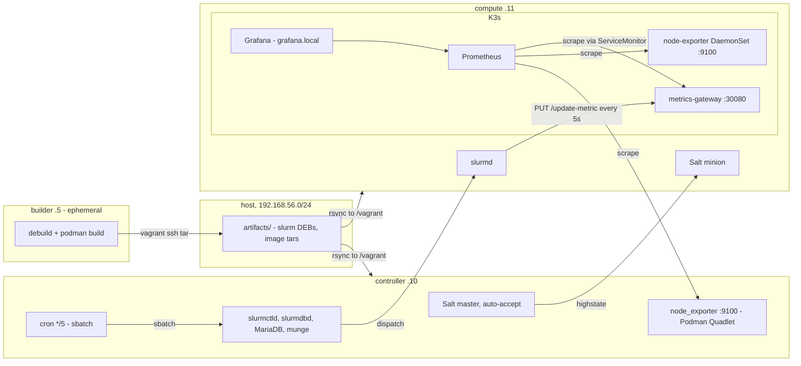
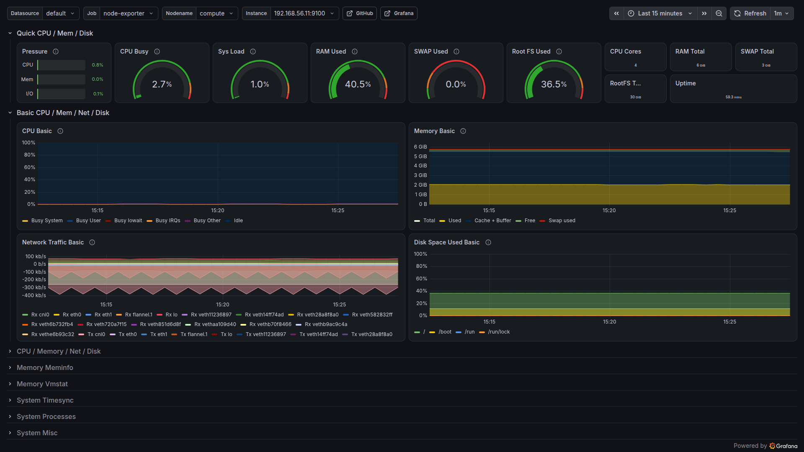
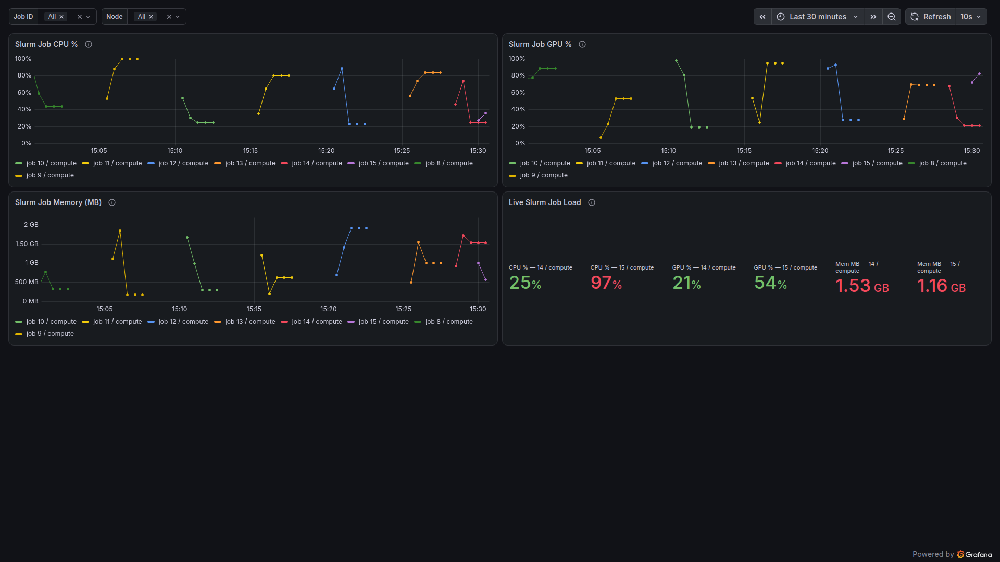

# HPC-DevOps hybrid orchestrator

A three-node Vagrant lab that puts a traditional HPC scheduler and a cloud-native
monitoring stack on the same private network and wires them together. Slurm is compiled
from source into Debian packages, installed by SaltStack, and its jobs report live load
into Prometheus through a small custom gateway that ends up on a Grafana dashboard. One
`vagrant up` builds all of it from nothing.

The three machines each have one job. **builder** is ephemeral: it installs the build
dependencies, compiles the separated `slurm-smd-*` DEBs the official Debian way, builds
the metrics gateway container image, exports everything to the host, and powers itself
off. **controller** is the Salt master and its own minion, and runs slurmctld, slurmdbd,
MariaDB, munge, and a node_exporter container under Podman. **compute** is a Salt minion
running slurmd next to a single-node K3s cluster hosting kube-prometheus-stack and the
gateway.

The interesting path through the system is the last one. Every five minutes cron on the
controller submits a Slurm job; slurmctld dispatches it to slurmd on compute; the job
reports simulated CPU, GPU and memory values to the gateway twelve times over a minute,
labelled with its own `SLURM_JOB_ID` and `SLURMD_NODENAME`; Prometheus scrapes the
gateway; and the "Live Slurm Job Load" dashboard in Grafana graphs it. Nothing in that
chain is mocked.



## Prerequisites

- VirtualBox 7.1 or 7.2. A `vmware_desktop` provider block is kept in the Vagrantfile as
  an alternative, but VirtualBox is what this was built and verified on.
- Vagrant 2.4.x.
- About 9GB of free RAM at peak. The builder (4GB) halts before the other two boot;
  controller (3GB) and compute (6GB) are what stay up. Roughly 25GB of disk.
- `curl` and GNU make on the host for `make verify`.

Verified on Ubuntu amd64 with VirtualBox 7.2.6 and Vagrant 2.4.9, and earlier on macOS
arm64. The box is `bento/ubuntu-24.04` at a pinned version, which publishes both
architectures, so a reviewer on Intel rebuilds identical artifacts transparently.

One trap worth knowing about on Linux hosts. On kernel 6.12 and later the in-tree KVM
modules can claim the CPU's virtualization extensions at load time, and VirtualBox then
refuses to start any VM with `VERR_VMX_IN_VMX_ROOT_MODE`. Whether the conflict actually
bites depends on the kernel and VirtualBox build — on the machine this lab was verified
on (kernel 7.0, VirtualBox 7.2.6) the two coexisted without issue. If you do hit that
error, unload the modules and retry:

```sh
sudo modprobe -r kvm_intel kvm     # kvm_amd on AMD hosts
```

If something keeps loading them back, blacklist them in `/etc/modprobe.d/`. This is a
host-level conflict, not a Vagrant or VirtualBox misconfiguration, and no amount of
retrying `vagrant up` alone gets past it.

## Quick start

```sh
git clone <this repo> && cd bigarch-devops-assignment
vagrant up            # or: make up
```

That is the whole deployment. A `before :up` trigger runs `scripts/gen-secrets.sh`
first, which generates `salt/pillar/secrets.sls` with a random slurmdbd password and a
random 128-byte munge key. The file is gitignored and the script is a no-op if it
already exists, so repeated runs never rotate a live secret and no credential is ever
committed.

Expect roughly 25 minutes cold on a reasonably modern machine. The builder is the long
pole at about 14 minutes on a 16-thread host, almost all of it compiling Slurm; it halts
itself when it is done, and a second `vagrant up` skips the compile through a version
stamp and returns almost immediately. The controller takes about 4 minutes and compute
about 6, most of the latter being kube-prometheus-stack pulling images.

To reach Grafana, point `grafana.local` at the compute node on whatever machine you are
browsing from:

```sh
echo "192.168.56.11 grafana.local" | sudo tee -a /etc/hosts
```

Then open <https://grafana.local> and log in with **admin / admin**. The browser will
warn about the certificate. That is expected: the ingress asks for TLS without naming a
secret, so Traefik answers with its built-in self-signed certificate. Click through it.
Adding cert-manager to issue a certificate for a hostname that only exists in
`/etc/hosts` would be ceremony.

## Verifying the deployment

```sh
make verify
```

`scripts/verify.sh` runs from the host and prints one `ok` or `FAIL` line per check,
exiting non-zero if any of them failed. It asserts that the builder is powered off and
the other two are running, that `sinfo` on the controller reports a node in
idle/alloc/mix, that both node exporters answer on port 9100, that a probe metric PUT to
the gateway's NodePort comes back 204 and then shows up in its `/metrics` output, and
that Prometheus reports zero targets in any state other than up.

For reference, this is what a healthy lab looked like on the last full verification run,
on an Ubuntu amd64 host: 17 Slurm 26.05.3 DEBs built on the builder, K3s v1.36.4+k3s1
with the node Ready, kube-prometheus-stack 88.6.2 with every pod Running, and Prometheus
reporting 15 targets with none down — including the `node-exporter` job scraping both
`192.168.56.10:9100` and `192.168.56.11:9100`, and the gateway's own ServiceMonitor
target. `srun` and `sbatch` round-trips reached COMPLETED and the gateway PUT returned
204 with the series visible on the next scrape.

The gateway also has a host-side unit suite — `make test` creates a venv under
`gateway/` and runs 28 pytest cases covering the PUT/scrape roundtrip, label-shape
conflicts, malformed payloads, and the TTL expiry boundary. No VM needed.

For manual spot checks, the useful ones are:

```sh
vagrant ssh controller -c 'sinfo'                     # compute node idle
vagrant ssh controller -c 'srun -N1 hostname'         # prints: compute
vagrant ssh controller -c 'sacct -X --format=JobID,JobName,State'
```

In Grafana, the two dashboards to open by name are **Node Exporter Full**, which should
show both nodes in its instance picker, and **Live Slurm Job Load**, which fills in
within a minute of the cron job firing. If you have just brought the lab up you may have
to wait for the next five-minute boundary, or submit one by hand with
`vagrant ssh controller -c 'sudo /opt/slurm/submit_job.sh'`.

## How it works

### The builder

The builder's highstate applies the same shared `podman` state the controller uses, and
`salt/states/build/init.sls` then runs `scripts/build.sh`. The build follows SchedMD's own Debian flow rather than a
hand-rolled `configure && make`: `mk-build-deps -i debian/control` installs the build
dependencies straight out of the tarball's own control file, and `debuild -b -uc -us`
produces the separated `slurm-smd-*` packages. The gateway image is built with
`podman build` and saved as a tar alongside the node_exporter image.

Everything lands in `/opt/artifacts` in the guest. A Vagrant trigger scoped to the
builder's define block then streams that directory to the host over
`vagrant ssh builder -c 'sudo tar -cf -'` and powers the machine off. There is no NFS
anywhere in this project, on purpose, so this SSH pull is the only path artifacts have
back to the host; from there the ordinary one-way rsync synced folder carries them into
the other two guests. A `BUILD_STAMP` carrying the Slurm version and architecture is
written last, and both the build state and the controller/compute preconditions key off
it, so a missing or half-finished build fails early with a message that names the fix.

### The controller

The Vagrant salt provisioner installs the master with `auto_accept: True` and the
controller's own minion, but with `run_highstate: false`. Vagrant refuses
`install_master` together with `run_highstate` unless minion keys are pre-seeded, and its
master-mode highstate path does not propagate state failures anyway. A follow-up shell
provisioner named `highstate` runs
`salt-call state.highstate --retcode-passthrough --state-output=mixed` instead, which
keeps the mandated provisioner in place and makes a failed state actually fail
`vagrant up` rather than scroll past.

From there the states do the expected things in the expected order: munge key from
pillar, MariaDB with the accounting database, the DEBs installed by pointing `apt-get
install` at their paths rather than `dpkg -i` so apt resolves the dependencies between
them, then slurmdbd and slurmctld, and a node_exporter container managed as a Podman
Quadlet unit so systemd owns its lifecycle and a re-run cannot produce a second
container.

### The compute node

The minion registers with the master at `192.168.56.10` and its key is accepted
automatically. Slurm's compute-side packages and `cgroup.conf` come from the same shared
templates the controller uses.

K3s is installed with three flags that matter:
`--node-ip 192.168.56.11 --flannel-iface <private nic> --write-kubeconfig-mode 644`.
Without the first two, K3s binds Vagrant's NAT interface and nothing on the private
network can reach the API server or the gateway's NodePort. The interface name is derived
from whichever NIC actually holds the compute address rather than hardcoded to `eth1`,
with a pillar override available.

Both Helm releases go in through `helm upgrade --install --wait`: kube-prometheus-stack
from the upstream repo at a pinned chart version, and the local gateway chart from
`/vagrant/charts/metrics-gateway`. The gateway chart ships a ServiceMonitor carrying
kube-prometheus-stack's release label, without which Prometheus never selects it and the
whole validation loop produces an empty panel. The two Grafana dashboards are vendored as
JSON in this repo and delivered as labelled ConfigMaps that Grafana's sidecar imports.

### The Phase 5 loop

`cron.present` on the controller writes one root crontab entry running
`/opt/slurm/submit_job.sh` every five minutes. That wrapper does nothing but
`sbatch /opt/slurm/simulate_metrics.sbatch` with absolute paths, because cron's PATH is
close to empty. The job itself loops twelve times with a five-second sleep, and each pass
PUTs three metrics — `slurm_job_cpu_percent`, `slurm_job_gpu_percent`, `slurm_job_mem_mb`
— to the gateway on `192.168.56.11:30080`, labelled with `slurm_job_id` and `node` taken
from `SLURM_JOB_ID` and `SLURMD_NODENAME`. Those variables only exist inside a
Slurm-launched process, which is the reason this is a real Slurm job and not a shell
script pretending to be one.

The gateway holds its series in memory with a TTL (90 seconds here, set from pillar
through the chart values). When a job ends its series stop being
refreshed and expire, so the dashboard goes quiet instead of showing a flat line at the
last value forever.

## Design decisions and interpretations

**Auto-accept is mandated, and scoped.** The assignment names auto-accept explicitly, so
the master runs with `auto_accept: True`. Pre-seeding minion keys with `seed_master`
would be the safer arrangement and was considered, but it contradicts the instruction, so
the trade-off is documented rather than silently corrected. It is acceptable here because
the only network any of this is reachable on is an isolated host-only network with three
machines the same Vagrantfile created.

**"A Slurm job on the Controller node" means submitted from the controller.** Phase 1
puts slurmd on compute and only slurmctld on the controller, so a job that executes on
the controller is not possible without contradicting the node roles. The reading that
holds both statements together is that the controller is the submission host: cron and
sbatch live there, slurmd on compute runs the work.

**Two node exporters, one scrape job.** The assignment asks for a node exporter running
under Podman on the controller, and separately for `additionalScrapeConfigs` to scrape
the exporters on both nodes. The controller's is therefore the mandated Podman Quadlet
container on host network, while compute's port 9100 is served by the node-exporter
DaemonSet that ships with kube-prometheus-stack. One static scrape job covers both by
address, which keeps the `job` label identical for both nodes so dashboard 1860 works
unmodified. The DaemonSet's own ServiceMonitor is disabled, because leaving it on would
scrape compute twice and double every series.

**Rsync synced folders everywhere, no NFS.** macOS 15.4 and later has an unresolved nfsd
kernel panic that Vagrant environments reliably trigger, so NFS was off the table from
the start. Declaring every synced folder `type: "rsync"` gives identical one-way
behaviour on every provider and host OS, and the artifact return path is the SSH tar pull
described above. The cost is that edits on the host do not appear in a guest until
`vagrant rsync` runs, which is what `make provision` is for.

**MariaDB is provisioned with plain SQL, not Salt's mysql states.** `mysql_database` and
`mysql_user` need a Python MySQL driver importable by Salt's own interpreter, and Salt
3008 ships as a onedir bundle that cannot see apt-installed packages. Rendering
`CREATE DATABASE IF NOT EXISTS` / `CREATE USER IF NOT EXISTS` / `GRANT` from pillar into a
root-only file and applying it over the unix socket is idempotent, has no dependencies,
and is obvious to read.

**Both Helm releases are guarded the same way.** The guard on each is a single `unless`
that checks the release reports `STATUS: deployed` *and* that a stamp file matches the
release's current inputs — the rendered values, plus a hash of every file in the chart for
the local one. The obvious alternatives each fail in a specific way: `onchanges` on the
values file alone can never retry a failed first install, because the file is written once
and stays unchanged; a status check alone never notices a values, chart or version change;
and both together inherit the first problem, because Salt requires every gate to pass
before a state runs. The stamp is false on a first run, false after a failure, false after
any input changes, and true only on a clean re-run.

**Dashboards are vendored and applied server-side.** Both dashboards are committed as
JSON and delivered as ConfigMaps rather than fetched from grafana.com at pod start, so the
deployment is reproducible offline. They are applied with `kubectl apply --server-side`
for a concrete reason: a client-side apply stores a copy of the whole object in the
`last-applied-configuration` annotation, and dashboard 1860 is about 469KB against a
256KB annotation limit. Server-side apply keeps no such copy.

**"Latest Slurm" is a pinned version.** The builder compiles 26.05.3, which was the
newest release on download.schedmd.com when this was built, and the version lives in one
pillar key. Fetching whatever is newest at provision time would make the deployment
unreproducible and the DEB install guard meaningless; bumping one pillar value and
re-running the builder is the supported way to move to a newer release.

**Grafana logs in with admin/admin.** "Default user/password" is read as Grafana's own
defaults, because that is what a reviewer will type first. Both values come from pillar
rather than being hardcoded in the chart values template.

**The munge key travels as base64 text.** The original design decoded it on the node with
`file.decode` from `contents_pillar`. That silently produces an empty key on Salt 3008:
the release masks pillar values as `**********` at the `pillar.get` module boundary and
lifts the mask only for template renderers and `file.managed`, and `file.decode` was
missed. It receives the mask string, discards it as invalid base64, writes a zero-byte
file, and reports Changed while doing it. Confirmed live against 3008.2. The fix is to
write the base64 text verbatim with `file.managed`; munged treats its keyfile as opaque
bytes, so the text form carries exactly the same entropy. If you ever need to see what a
minion really received, `salt-call pillar.get <key> unmask=True`.

## Idempotency

The rule the whole state tree is written to is that a second highstate changes nothing.
Every state either declares the end result or carries a guard that compares the system
against what it should be, and phase boundaries were checked with a full
`vagrant destroy -f && vagrant up` followed by a second highstate. The second run on a
fully provisioned lab:

```
controller:  Succeeded: 35  Failed: 0      # no changed count, nothing changed
compute:     Succeeded: 36  Failed: 0
```

`podman ps` on the controller shows exactly one node-exporter container after repeated
runs, and `crontab -l` shows exactly one entry — the `cron.present` state is pinned with
an `identifier`, so a schedule change rewrites the existing line instead of appending a
second one.

You can re-run a highstate at any time:

```sh
vagrant ssh controller -c 'sudo salt-call state.highstate'
vagrant ssh compute -c 'sudo salt-call state.highstate'
```

If you would rather drive it from the master, raise the timeout:
`salt -t 1200 'compute' state.highstate`. The default five-second gather timeout gives a
misleading "Minion did not return" during the long package and image installs while the
minion is in fact still working.

After editing Salt states on the host, remember that synced folders are rsync and only
sync on `up` and `reload`. `make provision` does the right thing: it rsyncs both guests
and re-runs both highstates. `make destroy` tears the whole lab down.

## AI use

This project was built with Claude Code, and the assignment asks for that to be explained
rather than glossed over, so here is what it actually looked like.

Claude Fable 5 led the sessions, with Opus and Sonnet subagents doing per-task authoring
and a separate adversarial review agent reading each task's output before anything was
committed. `CLAUDE.md` in this repo is not documentation written after the fact — it is
the working context the agents were given, and it is committed on purpose. Its "decisions
locked by the author" section lists the calls I made and told the agents not to relitigate
(auto-accept stays, no NFS, no map.jinja, admin/admin, the unused `import sys` stays), and
its "traps" section is a running list of things confirmed during research or found the
hard way, so that later tasks did not rediscover them.

Every task ran through the same loop: a written brief with explicit interfaces, an
authoring pass, an adversarial review pass, a fix round, and then live verification on the
actual VMs. That last step is the one that matters — several things that read perfectly
well did not survive contact with the machines.

Three concrete catches from the review and verification rounds, since specifics are more
useful than a claim of rigour:

- The dashboard ConfigMap for Grafana dashboard 1860 was originally applied client-side.
  Review caught that a 469KB dashboard cannot fit in the 256KB `last-applied-configuration`
  annotation a client-side apply writes, which is why it now uses `--server-side`.
- The munge key was written with `file.decode` from pillar, which is the idiomatic Salt
  approach and produces an empty key on Salt 3008 because of the pillar-masking regression
  described above. Found live, not in review; the state now uses `file.managed`.
- The first Helm guard combined `unless: helm status ... deployed` with `onchanges` on the
  values file. Review pointed out that Salt requires *all* gates to pass, so the pair is an
  AND, and the combination would have skipped legitimate upgrades and never retried a
  failed install. The guard was redesigned around a content stamp instead.

I reviewed every diff before it was committed and I can explain every line in this repo.
Where something is non-obvious, the rationale is in a comment next to it rather than in my
head.

One thing that deserves a direct mention: `gateway/app.py` imports `sys` and never uses
it, with no comment saying so. That is the assignment's Phase 4 instruction, followed
literally. No linter or CI is configured in this repo for the same reason: any Python
linter would flag that line, and the "fix" would be to break an explicit requirement. I
read the instruction as a check on whether submitters read the spec and review what their
tools produce, so it stays, and this paragraph is where it gets acknowledged.

## Known limitations

These are deliberate trade-offs for a lab, not oversights. None of them would survive a
review of a real deployment.

- **Auto-accept.** Any minion that can reach the master's ports gets its key accepted. Safe
  only because the network is an isolated three-machine host-only network.
- **admin/admin on Grafana**, from pillar, documented above, and wrong anywhere real.
- **Self-signed certificate.** Traefik's default certificate, so browsers warn. No
  cert-manager, no ACME.
- **The gateway keeps state in memory and runs one worker** on Flask's built-in server.
  Restarting the pod loses every series, and it would not survive being scaled past one
  replica, since the dict lives in a single process.
- **Metrics expire.** A dashboard opened when no job has run in the last TTL window is
  empty, by design. That is preferable to a flat line implying a job is still running.
- **Synced folders are one-way.** Edit on the host, then `vagrant rsync` and provision.
  Changes made inside a guest are not synced back and will be overwritten.

## Screenshots




